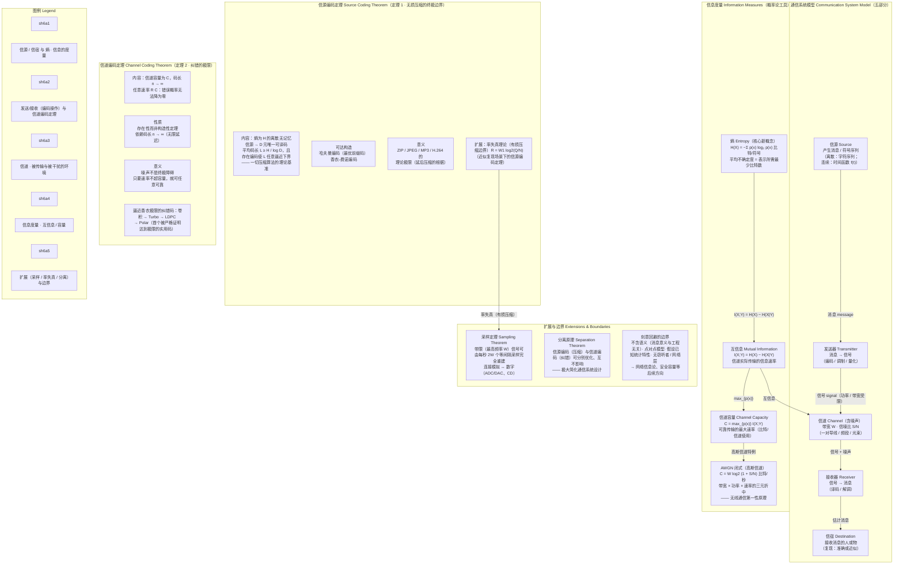

```mermaid
flowchart TD
    subgraph g_sh1["通信系统模型 Communication System Model（五部分）"]
        n0["信源 Source<br/>产生消息 / 符号序列<br/>（离散：字符序列；<br/>连续：时间函数 f(t)）"]
        n1["发送器 Transmitter<br/>消息 → 信号<br/>（编码 / 调制 / 量化）"]
        n2["信道 Channel（含噪声）<br/>带宽 W · 信噪比 S/N<br/>（一对导线 / 频段 / 光束）"]
        n3["接收器 Receiver<br/>信号 → 消息<br/>（译码 / 解调）"]
        n4["信宿 Destination<br/>接收消息的人或物<br/>（复现：准确或近似）"]
    end
    subgraph g_sh2["信息度量 Information Measures（概率论工具）"]
        n5["熵 Entropy（核心新概念）<br/>H(X) = −Σ p(x) log₂ p(x) 比特/符号<br/>平均不确定度 = 表示所需最少比特数"]
        n6["互信息 Mutual Information<br/>I(X;Y) = H(X) − H(X|Y)<br/>信道实际传输的信息速率"]
        n7["信道容量 Channel Capacity<br/>C = max_{p(x)} I(X;Y)<br/>可靠传输的最大速率（比特/信道使用）"]
        n8["AWGN 闭式（高斯信道）<br/>C = W log2 (1 + S/N) 比特/秒<br/>带宽 × 功率 × 速率的三元折中<br/>—— 无线通信第一性原理"]
    end
    subgraph g_sh3["信源编码定理 Source Coding Theorem（定理 1 · 无损压缩的终极边界）"]
        n9["内容：熵为 H 的离散无记忆信源 → D 元唯一可译码<br/>平均码长 L ≥ H / log D，且存在编码使 L 任意逼近下界<br/>—— 一切压缩算法的理论基准"]
        n10["可达构造<br/>哈夫曼编码（最优前缀码）<br/>香农–费诺编码"]
        n11["意义<br/>ZIP / JPEG / MP3 / H.264 的<br/>理论极限（延后压缩的根据）"]
        n12["扩展：率失真理论（有损压缩边界）R = W1 log2(Q/N)<br/>（近似复现场景下的信源编码定理）"]
    end
    subgraph g_sh4["信道编码定理 Channel Coding Theorem（定理 2 · 纠错的极限）"]
        n13["内容：信道容量为 C，码长 n → ∞<br/>任意速率 R C：错误概率无法降为零"]
        n14["性质<br/>存在性而非构造性定理<br/>依赖码长 n → ∞（无限延迟）"]
        n15["意义<br/>噪声不是终极障碍<br/>只要速率不超容量，就可任意可靠"]
        n16["逼近香农极限的纠错码：卷积 → Turbo → LDPC <br/>→ Polar（首个被严格证明达到极限的实用码）"]
    end
    subgraph g_sh5["扩展与边界 Extensions & Boundaries"]
        n17["采样定理 Sampling Theorem<br/>带限（最高频率 W）信号可由每秒 2W 个等间隔采样完全重建<br/>连接模拟 ↔ 数字（ADC/DAC、CD）"]
        n18["分离原理 Separation Theorem<br/>信源编码（压缩）与信道编码（纠错）可分别优化、互不影响<br/>—— 极大简化通信系统设计"]
        n19["刻意回避的边界<br/>不含语义（消息意义与工程无关）· 点对点模型· 假设已知统计特性· 无窃听者 / 网络层<br/>→ 网络信息论、安全容量等后续方向"]
    end
    subgraph g_sh6["图例 Legend"]
        n20["sh6a1"]
        n21["信源 / 信宿 与 熵 · 信息的度量"]
        n22["sh6a2"]
        n23["发送/接收（编码操作）与 信道编码定理"]
        n24["sh6a3"]
        n25["信道 · 被传输与被干扰的环境"]
        n26["sh6a4"]
        n27["信息度量 · 互信息 / 容量"]
        n28["sh6a5"]
        n29["扩展（采样 / 率失真 / 分离）与边界"]
    end
    n0 -->|"消息 message"| n1
    n1 -->|"信号 signal（功率 / 带宽受限）"| n2
    n2 -->|"信号 + 噪声"| n3
    n3 -->|"估计消息"| n4
    n5 -->|"I(X;Y) = H(X) − H(X|Y)"| n6
    n6 -->|"max_{p(x)}"| n7
    n7 -->|"高斯信道特例"| n8
    n12 -->|"率失真（有损压缩）"| n17
    n6 -->|"互信息"| n2
```
