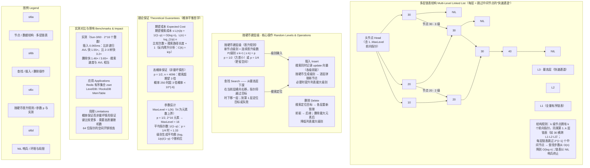

```mermaid
flowchart TD
    subgraph g_sl1["多层链表结构 Multi-Level Linked List（每层 = 跳过中间节点的“快速通道”）"]
        n0["头节点 Head<br/>（含 1..MaxLevel<br/>前向指针）"]
        n1["L3 · 最高层（快速通道）"]
        n2["L2"]
        n3["L1（全量有序链表）"]
        n4["30"]
        n5["NIL"]
        n6["20"]
        n7["30"]
        n8["NIL"]
        n9["10"]
        n10["20"]
        n11["30"]
        n12["40"]
        n13["NIL"]
        n14["结构规则：k 级节点拥有 k 个前向指针，同属第 1..k 层链表（如 30 横跨 L1·L2·L3）；<br/>每层链表跳过 2^{i−1} 个中间节点 → 查找步数从 O(n) 降到 O(log n)；链表以 NIL 哨兵终止"]
    end
    subgraph g_sl2["抛硬币建层级 · 核心操作 Random Levels & Operations"]
        n15["抛硬币建层级（晋升规则）<br/>新节点级别 = 连续晋升级数<br/>P(级别 ≥ k+1 | ≥ k) = p<br/>p = 1/2（方差小）或 p = 1/4（更省空间）"]
        n16["查找 Search —— 从最高层下探<br/>在当前层横向右移，指针将越过目标<br/>时下移一层；到第 1 层定位目标或失败"]
        n17["插入 Insert<br/>搜索同时记录 update 向量（各级前驱）<br/>抛硬币生成级别 → 逐层拼接新节点<br/>必要时提升列表最大级别"]
        n18["删除 Delete<br/>搜索定位目标 → 各层重新链接<br/>前驱 → 后继；删除最大元素后<br/>降低列表最大级别"]
    end
    subgraph g_sl3["理论保证 Theoretical Guarantees（概率平衡哲学）"]
        n19["期望成本 Expected Cost<br/>期望搜索成本 ≤ L(n)/p + 1/(1−p) = O(log n)，L(n) = log_{1/p} n<br/>比较次数 = 搜索路径长度 + 1（反向爬升分析：C(k) = k/p）"]
        n20["高概率保证（非最坏情形）<br/>p = 1/2, n = 4096：搜索超期望 3 倍<br/>概率 250 时超 3 倍概率 < 10^{-6}"]
        n21["参数设计<br/>MaxLevel = L(N)（N 为元素数上界）<br/>p = 1/2, 2^16 元素 → MaxLevel = 16<br/>平均指针数 1/(1−p)：p = 1/4 时 ≈ 1.33<br/>级别生成平均需 (log₂ 1/p)/(1−p) 个随机位"]
    end
    subgraph g_sl4["实测对比与影响 Benchmarks & Impact"]
        n22["实测（Sun-3/60 · 2^16 个整数）<br/>插入 0.065ms：比非递归 AVL 快 1.55×，比 2-3 树快 3.2×<br/>删除快 1.46× / 3.65× · 搜索速度与 AVL 相当"]
        n23["应用 Applications<br/>Redis 有序集合 zset<br/>LevelDB / RocksDB MemTable"]
        n24["局限 Limitations<br/>概率保证而非最坏情形保证<br/>键比较更多 · 需要高质量随机数<br/>64 位指针的空间开销较高"]
    end
    subgraph g_sl6["图例 Legend"]
        n25["sl6a"]
        n26["节点 / 数据结构 · 多层链表"]
        n27["sl6b"]
        n28["查找 / 插入 / 删除操作"]
        n29["sl6c"]
        n30["抛硬币晋升规则 / 参数 p 与实测"]
        n31["sl6d"]
        n32["NIL 哨兵 / 环境与局限"]
    end
    n0 --> n4
    n4 --> n5
    n0 --> n6
    n6 --> n7
    n7 --> n8
    n0 --> n9
    n9 --> n10
    n10 --> n11
    n11 --> n12
    n12 --> n13
    n4 -->|"节点 30 · 3 级"| n7
    n7 --> n11
    n6 -->|"节点 20 · 2 级"| n10
    n15 -->|"级别输入"| n17
    n16 -->|"搜索定位"| n17
```
