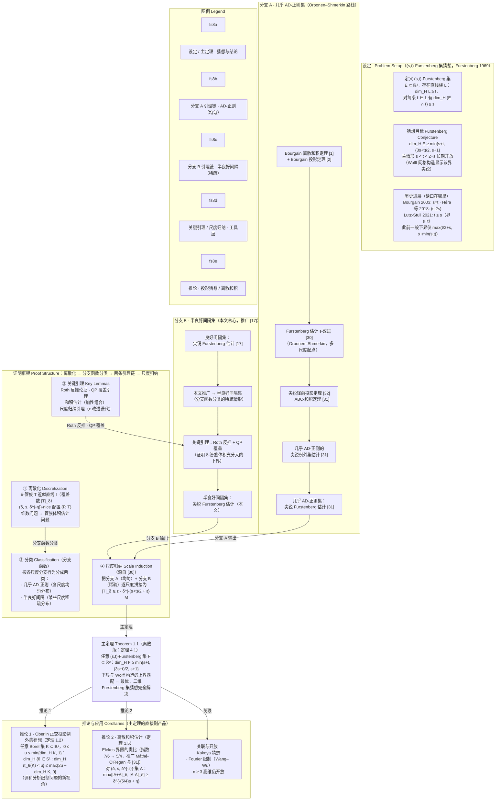

```mermaid
flowchart TD
    n16["主定理 Theorem 1.1（离散版：定理 4.1）<br/>任意 (s,t)-Furstenberg 集 F ⊂ ℝ²：dim_H F ≥ min{s+t, (3s+t)/2, s+1}<br/>下界与 Wolff 构造的上界匹配 → 最优，二维 Furstenberg 集猜想完全解决"]
    subgraph g_fs1["设定 · Problem Setup（(s,t)-Furstenberg 集猜想，Furstenberg 1969）"]
        n0["定义 (s,t)-Furstenberg 集<br/>E ⊂ ℝ²，存在直线族 L：dim_H L ≥ t，<br/>对每条 ℓ ∈ L 有 dim_H (E ∩ ℓ) ≥ s"]
        n1["猜想目标 Furstenberg Conjecture<br/>dim_H E ≥ min{s+t, (3s+t)/2, s+1}<br/>主情形 s < t < 2−s 长期开放<br/>（Wolff 网格构造显示该界尖锐）"]
        n2["历史进展（缺口在哪里）<br/>Bourgain 2003: s=t · Héra 等 2018: (s,2s)<br/>Lutz-Stull 2021: t ≤ s（界 s+t）<br/>此前一般下界仅 max(t/2+s, s+min(s,t))"]
    end
    subgraph g_fs2["证明框架 Proof Structure：离散化 → 分支函数分类 → 两条引理链 → 尺度归纳"]
        n3["① 离散化 Discretization<br/>δ-管族 T 近似直线 ℓ（覆盖数 |T|_δ）<br/>(δ, s, δ^{-η})-nice 配置 (P, T)<br/>维数问题 → 管族体积估计问题"]
        n4["② 分类 Classification（分支函数）<br/>按各尺度分支行为分成两类：<br/>· 几乎 AD-正则（各尺度均匀分布）<br/>· 半良好间隔（某些尺度稀疏分布）"]
        n5["③ 关键引理 Key Lemmas<br/>Roth 反推论证 · QP 覆盖引理<br/>和积估计（加性组合）<br/>尺度归纳引理（ε-改进迭代）"]
        n15["④ 尺度归纳 Scale Induction（源自 [30]）<br/>把分支 A（均匀）+ 分支 B（稀疏）逐尺度拼接为 |T|_δ ≳ ε · δ^{-(s+t)/2 + ε} M"]
    end
    subgraph g_fs3["分支 A · 几乎 AD-正则集（Orponen–Shmerkin 路线）"]
        n6["Bourgain 离散和积定理 [1]<br/>+ Bourgain 投影定理 [2]"]
        n7["Furstenberg 估计 ε-改进 [30]<br/>（Orponen–Shmerkin，多尺度起点）"]
        n8["尖锐径向投影定理 [32]<br/>→ ABC-和积定理 [31]"]
        n9["几乎 AD-正则的<br/>尖锐例外集估计 [31]"]
        n10["几乎 AD-正则集：<br/>尖锐 Furstenberg 估计 [31]"]
    end
    subgraph g_fs4["分支 B · 半良好间隔集（本文核心，推广 [17]）"]
        n11["良好间隔集：<br/>尖锐 Furstenberg 估计 [17]"]
        n12["本文推广 → 半良好间隔集<br/>（分支函数分类的稀疏情形）"]
        n13["关键引理：Roth 反推 + QP 覆盖<br/>（证明 δ-管族体积充分大的下界）"]
        n14["半良好间隔集：<br/>尖锐 Furstenberg 估计（本文）"]
    end
    subgraph g_fs7["推论与应用 Corollaries（主定理的直接副产品）"]
        n17["推论 1 · Oberlin 正交投影例外集猜想（定理 1.2）<br/>任意 Borel 集 K ⊂ ℝ²，0 ≤ u ≤ min{dim_H K, 1}：<br/>dim_H {θ ∈ S¹ : dim_H π_θ(K) < u} ≤ max{2u − dim_H K, 0}<br/>（调和分析限制问题的新视角）"]
        n18["推论 2 · 离散和积估计（定理 1.5）<br/>Elekes 界限的类比（指数 7/6 → 5/4，推广 Máthé-O'Regan 与 [31]）<br/>对 (δ, s, δ^{-ε})-集 A：<br/>max{|A+A|_δ, |A·A|_δ} ≥ δ^{-(5/4)s + η}"]
        n19["关联与开放<br/>· Kakeya 猜想<br/>· Fourier 限制（Wang–Wu）<br/>· n ≥ 3 高维仍开放"]
    end
    subgraph g_fs8["图例 Legend"]
        n20["fs8a"]
        n21["设定 / 主定理 · 猜想与结论"]
        n22["fs8b"]
        n23["分支 A 引理链 · AD-正则（均匀）"]
        n24["fs8c"]
        n25["分支 B 引理链 · 半良好间隔（稀疏）"]
        n26["fs8d"]
        n27["关键引理 / 尺度归纳 · 工具层"]
        n28["fs8e"]
        n29["推论 · 投影猜想 / 离散和积"]
    end
    n3 -->|"分支函数分类"| n4
    n5 -->|"Roth 反推 · QP 覆盖"| n13
    n6 --> n7
    n7 --> n8
    n8 --> n9
    n9 --> n10
    n11 --> n12
    n12 --> n13
    n13 --> n14
    n10 -->|"分支 A 输出"| n15
    n14 -->|"分支 B 输出"| n15
    n15 -->|"主定理"| n16
    n16 -->|"推论 1"| n17
    n16 -->|"推论 2"| n18
    n16 -->|"关联"| n19
```
