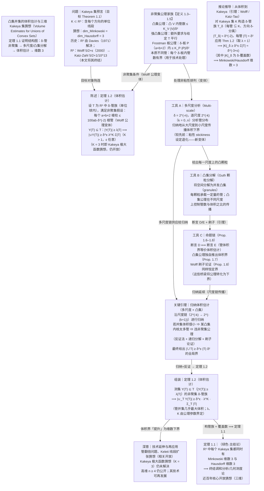

```mermaid
flowchart TD
    n0["凸集并集的体积估计与三维 Kakeya 集猜想（Volume Estimates for Unions of Convex Sets）<br/>定理 1.1 证明结构图：δ-管非聚集 → 多尺度/凸集分解 → 体积估计 → 维数 3"]
    n1["问题｜Kakeya 集预言（目标 Theorem 1.1）<br/>K ⊂ R³：含每个方向的单位线段<br/>猜想：dim_Minkowski = dim_Hausdorff = 3<br/>历史：R² 由 Davies（1971）解决；<br/>R³：Wolff 5/2+ε（2000）→ Katz-Zahl 5/2+1/10^13<br/>（本文将其终结）"]
    n2["陈述｜定理 1.2（体积估计）<br/>设 T 为 R³ 中 δ-管族（单位球内），满足非聚集假设：<br/>每个 a×b×2 棱柱 ≤ 100ab·δ^(-2) 根管（Wolff 公理变体）<br/>Y(T) ⊆ T：|Y(T)| ≥ λ|T| ⟹<br/>|∪Y(T)| ≥ δ^ε·λ^K·Σ|T|（K > 1，ε 任意）<br/>（K = 3 时即 Kakeya 极大函数猜想，仍开放）"]
    n3["非聚集公理家族【定义 1.3–1.5】<br/>凸集公理：凸 V 内管数 ≤ K_V·|V|/δ²<br/>强凸集公理：额外要求与给定 T 平行<br/>Frostman 板公理：δ-板 P（a×b×2）内 ≤ K_P·|P|/δ²<br/>本质不同管：每个 δ-板内管数有界（用于技术处理）"]
    n4["工具 A｜多尺度分析（Multi-scale）<br/>δ = 2^(-n)，逐尺度 2^(-k)（k = 0..n）分析管分布<br/>归纳地从大尺度到小尺度传播体积下界<br/>（较先前：粘性 stickiness 设定退化——新变体）"]
    n5["工具 B｜凸集分解（Guth 颗粒分解）<br/>将空间分解为并发凸集（granules）<br/>每颗粒承载一定量的管；凸集公理在不同尺度<br/>上控制管数与体积之比的传播"]
    n6["工具 C｜命题链（Prop. 1.6–1.8）<br/>断言 D ⟺ 断言 E（管体积界等价体积估计）<br/>凸集公理独自推出体积界（Prop. 1.7）<br/>Wolff 刷子论证（Prop. 1.8）同样恒定界<br/>（这些桥梁将公理转化为下界）"]
    n7["关键引理｜归纳体积估计（多尺度 + 凸集）<br/>沿尺度链（2^(-k) → 2^(-(k+1))）进行归纳<br/>若并集体积很小 ⇒ 某凸集内核太多管 ⇒ 违非聚集公理<br/>（反证法 + 递归分解 + 刷子论证）<br/>最终给出 |∪T| ≥ δ^ε·|T|·δ² 的全局界"]
    n8["组装｜定理 1.2（体积估计）<br/>测集 Y(T) ⊆ T（|Y(T)| ≥ λ|T|）的非聚集 δ-管族<br/>⟹ |∪_T Y(T)| ≥ δ^ε · λ^K · Σ_T |T|<br/>（管并集几乎最大体积；λ、K 由公理参数界定）"]
    n9["推论推导｜从体积到 Kakeya（引理：Wolff / Katz-Tao）<br/>对 Kakeya 集 K 构造 δ-管族 T_δ（每管 ⊆ K、方向 δ-分离）<br/>|T_δ| ≈ δ^(-2)，每管 |T| ≈ δ²<br/>应用 Thm 1.2（取 λ = 1）⟹ |K|_δ ≥ δ^ε·Σ|T| ≈ δ^(-3+ε)<br/>（其中 |K|_δ 为 δ-覆盖数）⟹ Minkowski/Hausdorff 维数 = 3"]
    n10["定理 1.1｜（绿色·主结论）<br/>R³ 中每个 Kakeya 集都同时有<br/>Minkowski 维数 3 与 Hausdorff 维数 3<br/>⟹ 终结调和分析/几何测度论<br/>近百年核心开放猜想（三维）"]
    n11["深意｜技术延伸与再应用<br/>管翻倍问题、Keleti 线段扩张猜想（相关开放）<br/>Kakeya 极大函数猜想（K = 3）仍未解决<br/>高维 n ≥ 4 仍公开；其技术可再发展"]
    n1 -->|"目标对象钩连"| n2
    n3 -->|"非聚集条件（Wolff 公理变体）"| n2
    n3 -->|"处理非粘性排列（变体）"| n4
    n4 -->|"给出每一尺度上的凸颗粒"| n5
    n5 -->|"断言 D/E + 刷子（引理）"| n6
    n4 -->|"多尺度链供应给归纳"| n7
    n7 -->|"归纳+反证 → 定理 1.2"| n8
    n8 -->|"体积界「提升」为维数下界"| n11
    n8 -->|"构管族 + 覆盖数 ⟹ 定理 1.1"| n10
    n6 -->|"归纳延续（尺度链传播）"| n7
```
