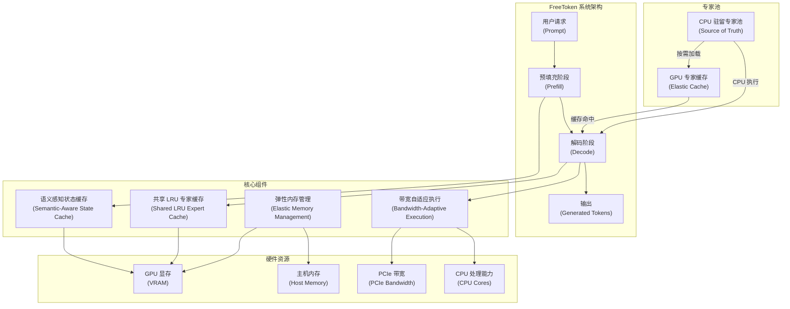

```mermaid
flowchart TD
    subgraph "FreeToken 系统架构"
        A["用户请求<br/>(Prompt)"]
        B["预填充阶段<br/>(Prefill)"]
        C["解码阶段<br/>(Decode)"]
        D["输出<br/>(Generated Tokens)"]
        
        A --> B
        B --> C
        C --> D
    end
    
    subgraph "核心组件"
        E["语义感知状态缓存<br/>(Semantic-Aware State Cache)"]
        F["带宽自适应执行<br/>(Bandwidth-Adaptive Execution)"]
        G["弹性内存管理<br/>(Elastic Memory Management)"]
        H["共享 LRU 专家缓存<br/>(Shared LRU Expert Cache)"]
    end
    
    subgraph "硬件资源"
        I["GPU 显存<br/>(VRAM)"]
        J["主机内存<br/>(Host Memory)"]
        K["PCIe 带宽<br/>(PCIe Bandwidth)"]
        L["CPU 处理能力<br/>(CPU Cores)"]
    end
    
    B --> E
    C --> F
    C --> H
    E --> I
    F --> K
    F --> L
    H --> I
    G --> I
    G --> J
    
    subgraph "专家池"
        M["CPU 驻留专家池<br/>(Source of Truth)"]
        N["GPU 专家缓存<br/>(Elastic Cache)"]
    end
    
    M -->|"按需加载"| N
    N -->|"缓存命中"| C
    M -->|"CPU 执行"| C
```