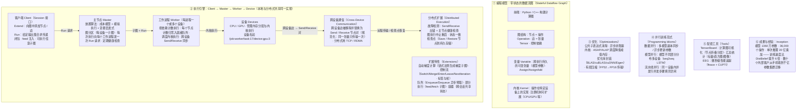

```mermaid
flowchart TD
    n11["③ 优化（Optimizations）<br/>公共子表达式消除 · 异步非阻塞内核 · ASAP/ALAP 调度降低峰值内存 ·<br/>优化库封装（BLAS/cuBLAS/cuDNN/Eigen）· 有损压缩（FP32→FP16 传输）"]
    n12["④ 并行训练范式（Programming Idioms）<br/>数据并行：多模型副本同步 / 异步更新参数<br/>模型并行：模型不同部分分布多设备（seq2seq LSTM）<br/>流水线并行：同一设备内并发行并发步骤填充空闲"]
    n13["⑤ 配套工具（Tools）<br/>TensorBoard：计算图可视化（节点折叠分层）· 汇总统计（标量/直方图/图像）<br/>EEG：微秒级性能追踪（ftrace + CUPTI）"]
    n14["⑥ 成果与经验：Inception 模型 1360 万参数 · 36,000 个操作 · 单次推理 20 亿乘加 —— 训练速度比 DistBelief 提升 6 倍 · 数十个内部客户从手机端到千亿参数集群迁移"]
    subgraph g_2["① 编程模型：带状态的数据流图（Stateful Dataflow Graph）"]
        n0["前端：Python / C++ 构建计算图"]
        n1["图结构：节点 = 操作 Operation · 边 = 张量 Tensor · 控制依赖"]
        n2["变量 Variable：跨执行持久的可变张量（模型参数）· Assign/AssignAdd"]
        n3["内核 Kernel：操作在特定设备上的实现 ·注册机制可扩展（CPU/GPU 等）"]
    end
    subgraph g_10["② 执行引擎：Client → Master → Worker → Device（本地与分布式共享同一实现）"]
        n4["客户端 Client（Session 接口）<br/>Extend：向图中添加节点 / 边<br/>Run：给定输出集合求传递闭包 · feed 注入 · 可执行任意子图"]
        n5["主节点 Master<br/>放置算法：成本模型 + 模拟执行 + 贪婪启发式<br/>图分区（每设备一子图）· 每次执行向每个工作进程发一次 Run 请求 · 定期健康检查"]
        n6["工作进程 Worker（每进程一个或多个设备）<br/>按依赖计数执行：每个节点计数归零入就绪队列 ·<br/>调度内核执行 · 跨设备 Send/Receive 同步"]
        n7["设备 Devices<br/>CPU / GPU · 管理内存分配与内核执行<br/>设备名如 /job:worker/task:17/device:gpu:3"]
        n8["跨设备通信（Cross-Device Communication）<br/>跨设备边被移除并替换为 Send / Receive 节点对（规范化：同一张量只传输一次）· 分布式用 TCP / RDMA"]
        n9["分布式扩展（Distributed Execution）<br/>故障检测：Send/Receive 出错 + 主节点健康检查<br/>图执行中止重启 · 状态一致检查点（Save / Restore 节点到持久存储）"]
        n10["扩展特性（Extensions）<br/>自动梯度计算（链式法则生成梯度子图）· 控制流（Switch/Merge/Enter/Leave/NextIteration · 标签与帧）<br/>队列（Enqueue/Dequeue 异步预取）· 部分执行（feed/fetch 子图）· 容器（跨会话共享状态）"]
    end
    n4 -->|"Run 请求"| n5
    n5 -->|"子图 + Run"| n6
    n6 -->|"内核执行"| n7
    n7 -->|"跨设备边 → Send/Receive 对"| n8
    n8 -->|"远程传输 / 检查点恢复"| n9
```
