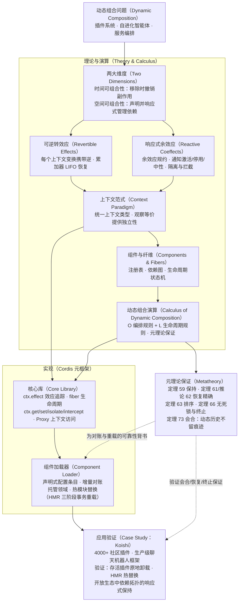

```mermaid
flowchart TD
    n0["动态组合问题（Dynamic Composition）<br/>插件系统 · 自进化智能体 · 服务编排"]
    n1["两大维度（Two Dimensions）<br/>时间可组合性：移除时撤销副作用<br/>空间可组合性：声明并响应式管理依赖"]
    n0 --> n1

    subgraph g_th["理论与演算（Theory & Calculus）"]
        n2["可逆转效应（Revertible Effects）<br/>每个上下文变换携带逆 · 累加器 LIFO 恢复"]
        n3["响应式余效应（Reactive Coeffects）<br/>余效应规约 · 通知激活/停用/中性 · 隔离与拦截"]
        n4["上下文范式（Context Paradigm）<br/>统一上下文类型 · 观察等价提供独立性"]
        n5["组件与纤维（Components & Fibers）<br/>注册表 · 依赖图 · 生命周期状态机"]
        n6["动态组合演算（Calculus of Dynamic Composition）<br/>O 编排规则 + L 生命周期规则 · 元理论保证"]
        n1 --> n2
        n1 --> n3
        n2 --> n4
        n3 --> n4
        n4 --> n5
        n5 --> n6
    end

    n7["元理论保证（Metatheory）<br/>定理 59 保持 · 定理 61/推论 62 恢复精确<br/>定理 63 排序 · 定理 66 无死锁与终止<br/>定理 73 会合：动态历史不留痕迹"]
    n6 --> n7

    subgraph g_impl["实现（Cordis 元框架）"]
        n8["核心库（Core Library）<br/>ctx.effect 效应追踪 · fiber 生命周期<br/>ctx.get/set/isolate/intercept · Proxy 上下文访问"]
        n9["组件加载器（Component Loader）<br/>声明式配置条目 · 增量对账<br/>托管领域 · 热模块替换（HMR 三阶段事务重载）"]
    end
    n4 --> n8
    n6 --> n8
    n8 --> n9
    n7 -.->|"为对账与重载的可靠性背书"| n9

    n10["应用验证（Case Study：Koishi）<br/>4000+ 社区插件 · 生产级聊天机器人框架<br/>验证：存活插件原地卸载 · HMR 热替换<br/>开放生态中依赖拓扑的响应式保持"]
    n9 --> n10
    n7 -.->|"验证会合/恢复/终止保证"| n10
```