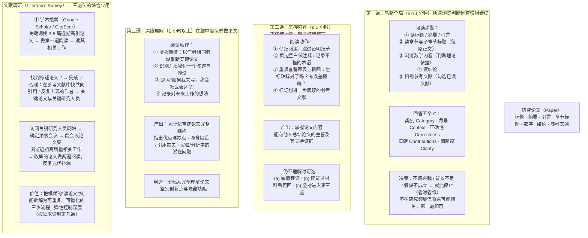

```mermaid
flowchart TD
    n0["研究论文（Paper）<br/>标题 · 摘要 · 引言 · 章节标题 · 数学 · 结论 · 参考文献"]
    subgraph g_3["第一遍：鸟瞰全局（5-10 分钟）· 快速浏览判断是否值得继续"]
        n1["阅读步骤：<br/>① 读标题 / 摘要 / 引言<br/>② 读章节与子章节标题（忽略正文）<br/>③ 浏览数学内容（判断理论依据）<br/>④ 读结论<br/>⑤ 扫视参考文献（勾选已读文献）"]
        n2["回答五个 C：<br/>类别 Category · 背景 Context · 正确性 Correctness<br/>贡献 Contributions · 清晰度 Clarity"]
        n3["决策：不感兴趣 / 背景不足 / 假设不成立 → 就此停止（省时省纸）<br/>不在研究领域但将来可能相关：第一遍即可"]
    end
    subgraph g_10["第二遍：掌握内容（≤ 1 小时）<br/>更仔细地读，跳过证明细节"]
        n4["阅读动作：<br/>① 仔细阅读，跳过证明细节<br/>② 页边空白做注释 / 记录不懂的术语<br/>③ 重点查看图表与插图：坐标轴标对了吗？有误差棒吗？<br/>④ 标记想进一步阅读的参考文献"]
        n5["产出：掌握论文内容<br/>能向他人总结论文的主旨及其支持证据"]
        n6["仍不理解时可选：<br/>(a) 搁置弃读 · (b) 读背景材料后再回 · (c) 坚持进入第三遍"]
    end
    subgraph g_20["第三遍：深度理解（1 小时以上）在脑中虚拟重做论文"]
        n7["阅读动作：<br/>① 虚拟重做：以作者相同假设重新实现论文<br/>② 识别并质疑每一个陈述与假设<br/>③ 思考“如果我来写，我会怎么表达？”<br/>④ 记录对未来工作的想法"]
        n8["产出：凭记忆重建论文完整结构<br/>指出优点与缺点 · 隐含假设 · 引用缺失 · 实验/分析中的潜在问题"]
        n9["用途：审稿人完全理解论文 · 鉴别创新点与隐藏缺陷"]
    end
    subgraph g_30["文献调研（Literature Survey）— 三遍法的综合应用"]
        n10["① 学术搜索（Google Scholar / CiteSeer）<br/>关键词找 3-5 篇近期高引论文 → 做第一遍阅读 → 读其相关工作"]
        n11["找到综述论文？→ 完成 ✓<br/>否则：在参考文献中找共同引用 / 反复出现的作者 → 关键论文与关键研究人员"]
        n12["访问关键研究人员网站 → 确定顶级会议 → 翻会议论文集<br/>浏览近期高质量相关工作 → 收集的论文做两遍阅读，反复迭代补漏"]
        n13["价值：把模糊的“读论文”技能拆解为可重复、可量化的三步流程 · 弹性控制深度（按需求读到第几遍）"]
    end
```
