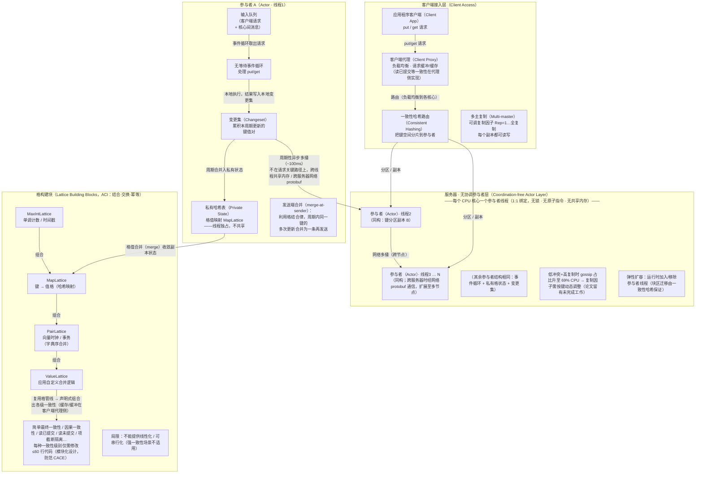

```mermaid
flowchart TD
    subgraph g_2["客户端接入层（Client Access）"]
        n0["应用程序客户端（Client App）<br/>put / get 请求"]
        n1["客户端代理（Client Proxy）<br/>负载均衡 · 请求缓冲/缓存<br/>（读已提交等一致性在代理侧实现）"]
        n2["一致性哈希路由（Consistent<br/>Hashing）<br/>把键空间分片到参与者"]
        n3["多主复制（Multi-master）<br/>可调复制因子 Rep=1…全复制<br/>每个副本都可读写"]
    end
    subgraph g_8["参与者 A（Actor · 线程1）"]
        n4["输入队列<br/>（客户端请求<br/>+ 核心间消息）"]
        n5["无等待事件循环<br/>处理 put/get"]
        n6["私有哈希表（Private State）<br/>格值映射 MapLattice<br/>——线程独占，不共享"]
        n7["变更集（Changeset）<br/>累积本周期更新的<br/>键值对"]
        n8["发送端合并（merge-at-sender）：<br/>利用格结合律，周期内同一键的<br/>多次更新合并为一条再发送"]
    end
    subgraph g_7["服务器 · 无协调参与者层（Coordination-free Actor Layer）<br/>——每个 CPU 核心一个参与者线程（1:1 绑定，无锁 · 无原子指令 · 无共享内存）——"]
        n9["参与者（Actor）· 线程2<br/>（同构：键分区副本 B）"]
        n10["参与者（Actor）· 线程3 … N<br/>（同构；跨服务器时经网络<br/>protobuf 通信，扩展至多节点）"]
        n11["（其余参与者结构相同：事件循环 + 私有格状态 + 变更集）"]
        n12["低冲突+高复制时 gossip 占比升至 69% CPU → 复制因子需按键动态调整（论文留有未完成工作）"]
        n13["弹性扩容：运行时加入/移除参与者线程（块区迁移由一致性哈希保证）"]
    end
    subgraph g_19["格构建块（Lattice Building Blocks，ACI：结合·交换·幂等）"]
        n14["MaxIntLattice<br/>单调计数 / 时间戳"]
        n15["MapLattice<br/>键 → 值格（哈希映射）"]
        n16["PairLattice<br/>向量时钟 / 事务<br/>（字典序合并）"]
        n17["ValueLattice<br/>应用自定义合并逻辑"]
        n18["简单最终一致性 / 因果一致性 / 读已提交 / 读未提交 / 项截断隔离…<br/>每种一致性级别仅需修改 ≤60 行代码（模块化设计，防范 CACE）"]
        n19["局限：不能提供线性化 / 可串行化（强一致性场景不适用）"]
    end
    n0 -->|"put/get 请求"| n1
    n1 -->|"路由（负载均衡到各核心）"| n2
    n2 -->|"分区 / 副本"| n9
    n2 -->|"分区 / 副本"| n10
    n4 -->|"事件循环取出请求"| n5
    n5 -->|"本地执行，结果写入本地变更集"| n7
    n7 -->|"周期合并入私有状态"| n6
    n7 -->|"周期性异步多播（~100ms）<br/>不在请求关键路径上，跨线程共享内存 / 跨服务器网络 protobuf"| n9
    n9 -->|"网络多播（跨节点）"| n10
    n6 -->|"格值合并（merge）收敛副本状态"| n15
    n14 -->|"组合"| n15
    n15 -->|"组合"| n16
    n16 -->|"组合"| n17
    n17 -->|"复用格管线 → 声明式组合出各级一致性（缓存/缓冲在客户端代理侧）"| n18
```
