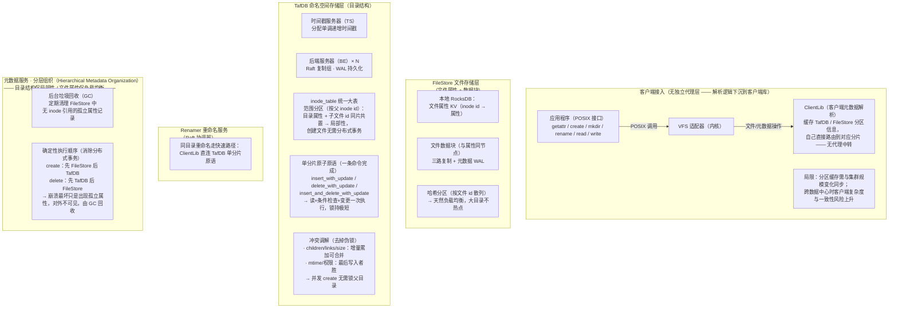

```mermaid
flowchart TD
    subgraph g_2["客户端接入（无独立代理层 —— 解析逻辑下沉到客户端库）"]
        n0["应用程序（POSIX 接口）<br/>getattr / create / mkdir / rename / read / write"]
        n1["VFS 适配器（内核）"]
        n2["ClientLib（客户端元数据解析）<br/>缓存 TafDB / FileStore 分区信息，<br/>自己直接路由到对应分片 —— 无代理中转"]
        n3["局限：分区缓存需与集群规模变化同步；<br/>跨数据中心时客户端复杂度与一致性风险上升"]
    end
    subgraph g_8["FileStore 文件存储层<br/>（文件属性 + 数据块）"]
        n4["本地 RocksDB：<br/>文件属性 KV（inode id → 属性）"]
        n5["文件数据块（与属性同节点）<br/>三路复制 + 元数据 WAL"]
        n6["哈希分区（按文件 id 散列）<br/>→ 天然负载均衡，大目录不热点"]
    end
    subgraph g_12["TafDB 命名空间存储层（目录结构）"]
        n7["时间戳服务器（TS）<br/>分配单调递增时间戳"]
        n8["后端服务器（BE）× N<br/>Raft 复制组 · WAL 持久化"]
        n9["inode_table 统一大表<br/>范围分区（按父 inode id）：<br/>目录属性 + 子文件 id 同片共置 → 局部性，<br/>创建文件无需分布式事务"]
        n10["单分片原子原语（一条命令完成）<br/>insert_with_update / delete_with_update /<br/>insert_and_delete_with_update<br/>→ 读+条件检查+变更一次执行，锁持极短"]
        n11["冲突调解（去掉伪锁）<br/>· children/links/size：增量累加可合并<br/>· mtime/权限：最后写入者胜<br/>→ 并发 create 无需锁父目录"]
    end
    subgraph g_18["Renamer 重命名服务<br/>（Raft 协调器）<br/>正常路径（约 1% 跨目录）<br/>传统锁 + 两阶段提交<br/>防孤儿环路"]
        n12["同目录重命名走快速路径：<br/>ClientLib 直连 TafDB 单分片原语"]
    end
    subgraph g_7["元数据服务 · 分层组织（Hierarchical Metadata Organization）<br/>—— 目录结构保局部性 / 文件属性保负载均衡 ——"]
        n13["后台垃圾回收（GC）<br/>定期清理 FileStore 中<br/>无 inode 引用的孤立属性记录"]
        n14["确定性执行顺序（消除分布式事务）<br/>create：先 FileStore 后 TafDB<br/>delete：先 TafDB 后 FileStore<br/>→ 崩溃最坏只是出现孤立属性，对外不可见，由 GC 回收"]
    end
    n0 -->|"POSIX 调用"| n1
    n1 -->|"文件/元数据操作"| n2
```
