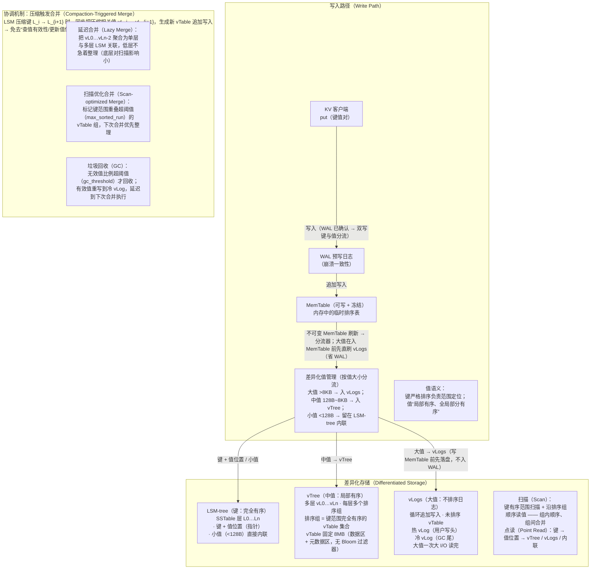

```mermaid
flowchart TD
    subgraph g_2["写入路径（Write Path）"]
        n0["KV 客户端<br/>put（键值对）"]
        n1["WAL 预写日志<br/>（崩溃一致性）"]
        n2["MemTable（可写 + 冻结）<br/>内存中的临时排序表"]
        n3["差异化值管理（按值大小分流）<br/>大值 >8KB → 入 vLogs；<br/>中值 128B~8KB → 入 vTree；<br/>小值 <128B → 留在 LSM-tree 内联"]
        n4["值语义：<br/>键严格排序负责范围定位；<br/>值“局部有序、全局部分有序”"]
    end
    subgraph g_8["差异化存储（Differentiated Storage）"]
        n5["LSM-tree（键：完全有序）<br/>SSTable 层 L0…Ln<br/>· 键 + 值位置（指针）<br/>· 小值（<128B）直接内联"]
        n6["vTree（中值：局部有序）<br/>多层 vL0…vLn · 每层多个排序组<br/>排序组 = 键范围完全有序的 vTable 集合<br/>vTable 固定 8MB（数据区 + 元数据区，无 Bloom 过滤器）"]
        n7["vLogs（大值：不排序日志）<br/>循环追加写入 · 未排序 vTable<br/>热 vLog（用户写头）<br/>冷 vLog（GC 尾）<br/>大值一次大 I/O 读完"]
        n8["扫描（Scan）：<br/>键有序范围扫描 + 沿排序组顺序读值 —— 组内顺序、组间合并<br/>点读（Point Read）：键 → 值位置 → vTree / vLogs / 内联"]
    end
    subgraph g_13["协调机制：压缩触发合并（Compaction-Triggered Merge）<br/>LSM 压缩键 L_i → L_{i+1} 时，同步把压缩相关值 vL_i → vL_{i+1}，生成新 vTable 追加写入<br/>→ 免去“查值有效性/更新值位置”的额外开销（隐藏在压缩本身）"]
        n9["延迟合并（Lazy Merge）：<br/>把 vL0…vLn-2 聚合为单层与多层 LSM 关联，低层不急着整理（底层对扫描影响小）"]
        n10["扫描优化合并（Scan-optimized Merge）：<br/>标记键范围重叠超阈值（max_sorted_run）的 vTable 组，下次合并优先整理"]
        n11["垃圾回收（GC）：<br/>无效值比例超阈值（gc_threshold）才回收；<br/>有效值重写到冷 vLog，延迟到下次合并执行"]
    end
    n0 -->|"写入（WAL 已确认 → 双写键与值分流）"| n1
    n1 -->|"追加写入"| n2
    n2 -->|"不可变 MemTable 刷新 → 分流器；大值在入 MemTable 前先直刷 vLogs（省 WAL）"| n3
    n3 -->|"键 + 值位置 / 小值"| n5
    n3 -->|"中值 → vTree"| n6
    n3 -->|"大值 → vLogs（写 MemTable 前先落盘，不入 WAL）"| n7
```
