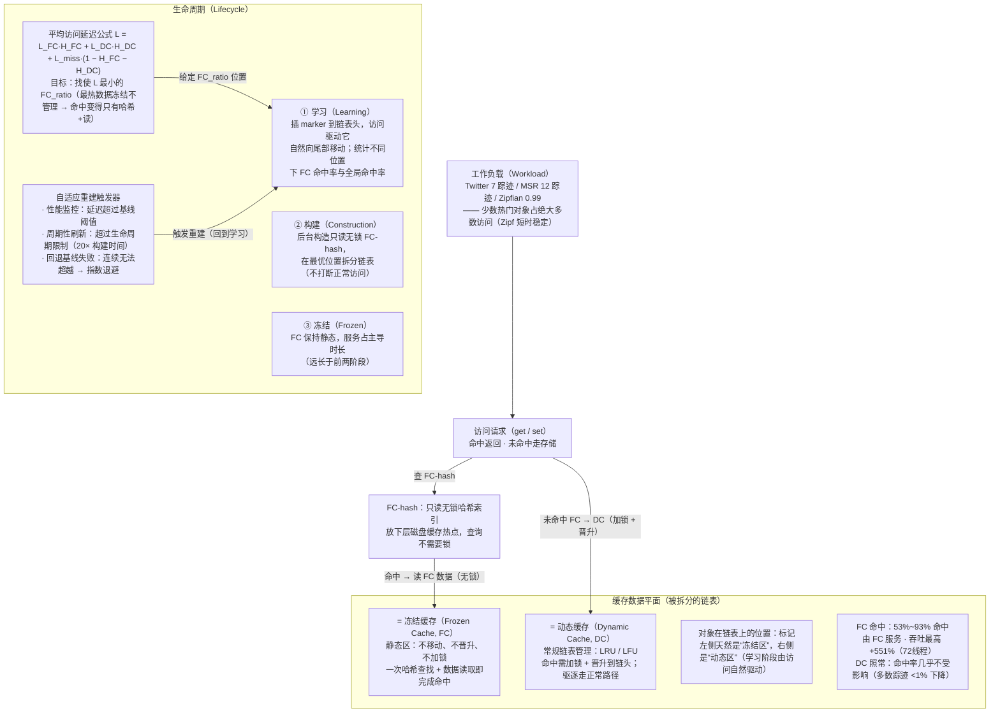

```mermaid
flowchart TD
    n0["工作负载（Workload）<br/>Twitter 7 踪迹 / MSR 12 踪迹 / Zipfian 0.99<br/>—— 少数热门对象占绝大多数访问（Zipf 短时稳定）"]
    n1["访问请求（get / set）<br/>命中返回 · 未命中走存储"]
    n2["FC-hash：只读无锁哈希索引<br/>放下层磁盘缓存热点，查询不需要锁"]
    subgraph g_5["缓存数据平面（被拆分的链表）"]
        n3["= 冻结缓存（Frozen Cache, FC）<br/>静态区：不移动、不晋升、不加锁<br/>一次哈希查找 + 数据读取即完成命中"]
        n4["= 动态缓存（Dynamic Cache, DC）<br/>常规链表管理：LRU / LFU<br/>命中需加锁 + 晋升到链头；<br/>驱逐走正常路径"]
        n5["对象在链表上的位置：标记左侧天然是“冻结区”，右侧是“动态区”（学习阶段由访问自然驱动）"]
        n6["FC 命中：53%~93% 命中由 FC 服务 · 吞吐最高 +551%（72线程）<br/>DC 照常：命中率几乎不受影响（多数踪迹 <1% 下降）"]
    end
    subgraph g_11["生命周期（Lifecycle）"]
        n7["① 学习（Learning）<br/>插 marker 到链表头，访问驱动它<br/>自然向尾部移动；统计不同位置<br/>下 FC 命中率与全局命中率"]
        n8["② 构建（Construction）<br/>后台构造只读无锁 FC-hash，<br/>在最优位置拆分链表<br/>（不打断正常访问）"]
        n9["③ 冻结（Frozen）<br/>FC 保持静态，服务占主导时长<br/>（远长于前两阶段）"]
        n10["自适应重建触发器<br/>· 性能监控：延迟超过基线阈值<br/>· 周期性刷新：超过生命周期限制（20× 构建时间）<br/>· 回退基线失败：连续无法超越 → 指数退避"]
        n11["平均访问延迟公式 L = L_FC·H_FC + L_DC·H_DC + L_miss·(1 − H_FC − H_DC)<br/>目标：找使 L 最小的 FC_ratio（最热数据冻结不管理 → 命中变得只有哈希+读）"]
    end
    n0 --> n1
    n1 -->|"查 FC-hash"| n2
    n2 -->|"命中 → 读 FC 数据（无锁）"| n3
    n1 -->|"未命中 FC → DC（加锁 + 晋升）"| n4
    n11 -->|"给定 FC_ratio 位置"| n7
    n10 -->|"触发重建（回到学习）"| n7
```
