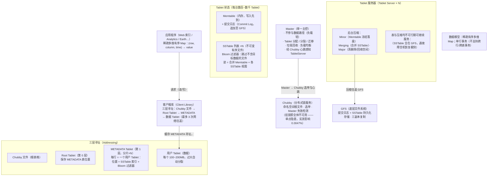

```mermaid
flowchart TD
    n0["客户端库（Client Library）<br/>三层寻址：Chubby 文件 → Root Tablet → METADATA → 数据 Tablet（最多 3 次网络往返）"]
    n1["应用程序（Web 索引 / Analytics / Earth…）<br/>稀疏多维有序 Map：(row, column, time) → value"]
    n2["Master（单一主控）<br/>· 不参与数据路径（负载轻）<br/>· Tablet 分配 / 分裂 / 迁移<br/>· 垃圾回收 · 负载均衡<br/>· 经 Chubby 心跳感知 TabletServer"]
    n3["Chubby（分布式锁服务）<br/>命名空间根文件 · 选举 · Master 失效检测<br/>（挂锁即全体不可用 —— 单点隐患，实测影响 0.0047%）"]
    n12["GFS（底层文件系统）<br/>提交日志 + SSTable 持久化存储 · 三副本复制"]
    n13["数据模型：稀疏有序多维 Map；单行事务（不支持跨行/跨表事务）"]
    subgraph g_6["三层寻址（Addressing）"]
        n4["Chubby 文件（根表格）"]
        n5["Root Tablet（第 0 层）<br/>保存 METADATA 表位置"]
        n6["METADATA Tablet（第 1 层，分片×N）<br/>每行 = 一个用户 Tablet：<br/>位置 + SSTable 索引 + Bloom 过滤器"]
        n7["用户 Tablet（数据）<br/>每个 100~200MB，过大自动分裂"]
    end
    subgraph g_12["Tablet 状态（每台数百~数千 Tablet）"]
        n8["Memtable（内存，写入先到）<br/>+ 提交日志（Commit Log，追加至 GFS）"]
        n9["SSTable 列表 ×N（不可变有序文件）<br/>Bloom 过滤器：跳过不含目标数据的文件<br/>读 = 合并 Memtable + 各 SSTable 视图"]
    end
    subgraph g_11["Tablet 服务器（Tablet Server × N）"]
        n10["后台压缩：<br/>Minor（Memtable 冻结落盘）<br/>Merging（合并 SSTable）· Major（清删除/回收空间）"]
        n11["表与压缩均不可行期可继续服务：<br/>（SSTable 全在 GFS，遇故障空机恢复极快）"]
    end
    n1 -->|"请求（读/写）"| n0
    n0 -->|"缓存 METADATA 寻址，"| n7
    n2 -->|"Master → Chubby 选举与心跳"| n3
    n10 -->|"压缩往返 GFS"| n12
```
