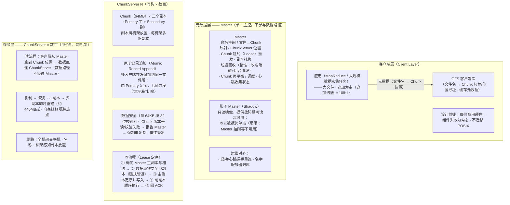

```mermaid
flowchart TD
    subgraph g_2["客户端层（Client Layer）"]
        n0["应用（MapReduce / 大规模数据密集任务）<br/>—— 大文件 · 追加为主（追加:覆盖 ≈ 108:1）"]
        n1["GFS 客户端库<br/>（文件名 → Chunk 句柄/位置寻址 · 缓存元数据）"]
        n2["设计前提：廉价商用硬件 · 组件失效为常态 · 不迁移 POSIX"]
    end
    subgraph g_6["元数据层 —— Master（单一主控，不参与数据路径）"]
        n3["Master<br/>· 命名空间 / 文件→Chunk 映射 / ChunkServer 位置<br/>· Chunk 租约（Lease）颁发 · 副本托管<br/>· 垃圾回收（惰性：改名隐藏+后台清理）<br/>· Chunk 再平衡 / 调度 · 心跳收集状态"]
        n4["影子 Master（Shadow）<br/>只读镜像，提供故障期间读高可用；<br/>写元数据仍单点（局限：Master 挂则写不可用）"]
        n5["运维对齐：<br/>· 启动/心跳握手重连 · 名字服务器归属"]
    end
    subgraph g_11["ChunkServer N（同构 × 数百）"]
        n6["Chunk（64MB）× 三个副本<br/>（Primary 主 + Secondary 副）<br/>副本跨机架放置 · 每机架多份副本"]
        n7["原子记录追加（Atomic Record Append）<br/>多客户端并发追加到同一文件尾：<br/>由 Primary 定序，无锁并发（“意见箱”比喻）"]
        n8["数据安全（每 64KB 块 32 位校验和）· Chunk 版本号<br/>读/校验失败 → 报告 Master → 强制重复制 · 惰性恢复"]
        n9["写流程（Lease 定序）<br/>① 询问 Master 主副本与租约 → ② 数据流推向全部副本（链式管道）→ ③ 主副本定序并写入 → ④ 副副本顺序执行 → ⑤ 回 ACK"]
    end
    subgraph g_10["存储层 —— ChunkServer × 数百（廉价机 · 跨机架）"]
        n10["读流程：客户端从 Master 拿到 Chunk 位置 → 数据直连 ChunkServer（数据路径不经过 Master）"]
        n11["复制 ↔ 恢复：3 副本 → 少副本即时重建（约 440MB/s）· 均衡迁移规避热点"]
        n12["线路：全机架交换机 · 名称：机架感知副本放置"]
    end
    n0 -->|"元数据（文件名 → Chunk 位置）"| n1
```
