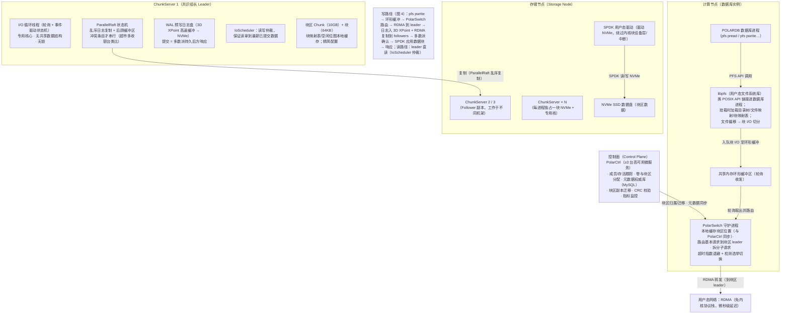

```mermaid
flowchart TD
    n0["控制面（Control Plane）<br/>PolarCtrl（≥3 台高可用微服务）<br/>· 成员/存活跟踪 · 卷与块区分配 · 元数据权威库（MySQL）<br/>· 块区副本迁移 · CRC 校验 · 指标监控"]
    n5["用户态网络：RDMA（免内核协议栈，微秒级延迟）"]
    n15["写路径（图 4）：pfs pwrite → 环形缓冲 → PolarSwitch 路由 → RDMA 到 leader → 日志入 3D XPoint + RDMA 复制到 followers → 多数派确认 → SPDK 应用数据块 → 响应；读路径：leader 直读（IoScheduler 仲裁）"]
    subgraph g_3["计算节点（数据库实例）"]
        n1["POLARDB 数据库进程<br/>（pfs pread / pfs pwrite…）"]
        n2["libpfs（用户态文件系统库）<br/>类 POSIX API 链接进数据库进程；<br/>挂载时加载目录树/文件映射/块映射表；<br/>文件偏移 → 块 I/O 切分"]
        n3["共享内存环形缓冲区（轮询收发）"]
        n4["PolarSwitch 守护进程<br/>本地缓存块区位置（与 PolarCtrl 同步）·<br/>路由基本请求到块区 leader · 拆分子请求<br/>超时指数退避 + 检测选举切换"]
    end
    subgraph g_10["ChunkServer 1（共识组长 Leader）"]
        n6["I/O 循环线程（轮询 + 事件驱动状态机）<br/>专用核心 · 无共享数据结构 · 无锁"]
        n7["ParallelRaft 状态机<br/>乱序日志复制 + 后顾缓冲区<br/>冲突条目才串行（超市多收银台类比）"]
        n8["WAL 预写日志盒（3D XPoint 高速缓冲 → NVMe）<br/>提交 = 多数派持久后方响应"]
        n9["IoScheduler：读写仲裁，<br/>保证读拿到最新已提交数据"]
        n10["块区 Chunk（10GB）+ 块（64KB）<br/>块映射表/空闲位图本地缓存；精简配置"]
    end
    subgraph g_9["存储节点（Storage Node）"]
        n11["ChunkServer 2 / 3（Follower 副本，工作于不同机架）"]
        n12["ChunkServer × N<br/>（每进程独占一块 NVMe + 专用核）"]
        n13["SPDK 用户态驱动（驱动 NVMe，绕过内核块设备层/中断）"]
        n14["NVMe SSD 数据盘（块区数据）"]
    end
    n0 -->|"块区归属/迁移 · 元数据同步"| n4
    n1 -->|"PFS API 调用"| n2
    n2 -->|"入队块 I/O 至环形缓冲"| n3
    n3 -->|"轮询取出并路由"| n4
    n4 -->|"RDMA 转发（到块区 leader）"| n5
    n7 -->|"复制（ParallelRaft 乱序复制）"| n11
    n13 -->|"SPDK 读/写 NVMe"| n14
```
