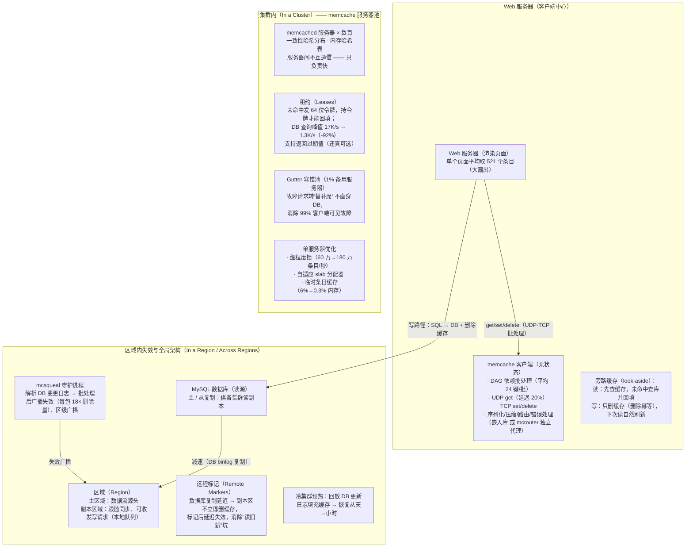

```mermaid
flowchart TD
    subgraph g_2["Web 服务器（客户端中心）"]
        n0["Web 服务器（渲染页面）<br/>单个页面平均取 521 个条目（大扇出）"]
        n1["memcache 客户端（无状态）<br/>· DAG 依赖批处理（平均 24 键/批）<br/>· UDP get（延迟-20%）· TCP set/delete<br/>· 序列化/压缩/路由/错误处理<br/>（嵌入库 或 mcrouter 独立代理）"]
        n2["旁路缓存（look-aside）：<br/>读：先查缓存，未命中查库并回填<br/>写：只删缓存（删除幂等），下次读自然刷新"]
    end
    subgraph g_6["集群内（In a Cluster）—— memcache 服务器池"]
        n3["memcached 服务器 × 数百<br/>一致性哈希分布 · 内存哈希表<br/>服务器间不互通信 —— 只负责快"]
        n4["租约（Leases）<br/>未命中发 64 位令牌，持令牌才能回填；<br/>DB 查询峰值 17K/s → 1.3K/s（-92%）<br/>支持返回过期值（还真可选）"]
        n5["Gutter 容错池（1% 备用服务器）<br/>故障请求转'替补席' 不直穿 DB，<br/>消除 99% 客户端可见故障"]
        n6["单服务器优化<br/>· 细粒度锁（60 万→180 万条目/秒）<br/>· 自适应 slab 分配器 <br/>· 临时条目缓存（6%→0.3% 内存）"]
    end
    subgraph g_11["区域内失效与全局架构（In a Region / Across Regions）"]
        n7["MySQL 数据库（读源）<br/>主 / 从复制：供各集群读副本"]
        n8["mcsqueal 守护进程<br/>解析 DB 变更日志 → 批处理后广播失效（每包 18× 删除量）、区级广播"]
        n9["区域（Region）<br/>主区域：数据流源头<br/>副本区域：跟随同步、可收发写请求（本地队列）"]
        n10["远程标记（Remote Markers）<br/>数据库复制延迟 → 副本区不立即删缓存，<br/>标记后延迟失效，消除“读旧新”坑"]
        n11["冷集群预热：回放 DB 更新日志填充缓存 → 恢复从天→小时"]
    end
    n0 -->|"get/set/delete（UDP·TCP 批处理）"| n1
    n0 -->|"写路径：SQL → DB + 删除缓存"| n7
    n8 -->|"失效广播"| n9
    n7 -->|"减速（DB binlog 复制）"| n9
```
