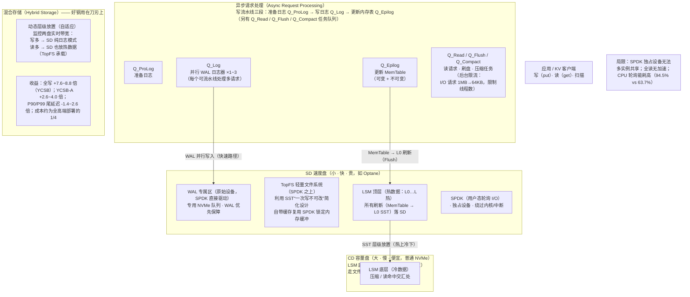

```mermaid
flowchart TD
    n0["应用 / KV 客户端<br/>写（put）· 读（get）· 扫描"]
    n12["局限：SPDK 独占设备无法多实例共享；全读无加速；CPU 轮询能耗高（94.5% vs 63.7%）"]
    subgraph g_3["异步请求处理（Async Request Processing）<br/>写流水线三段：准备日志 Q_ProLog → 写日志 Q_Log → 更新内存表 Q_Epilog<br/>（另有 Q_Read / Q_Flush / Q_Compact 任务队列）"]
        n1["Q_ProLog<br/>准备日志"]
        n2["Q_Log<br/>并行 WAL 日志器 ×1~3<br/>（每个可流水线处理多请求）"]
        n3["Q_Epilog<br/>更新 MemTable<br/>（可变 + 不可变）"]
        n4["Q_Read / Q_Flush / Q_Compact<br/>读请求 · 刷盘 · 压缩任务（后台限流：<br/>I/O 请求 1MB→64KB，限制线程数）"]
    end
    subgraph g_9["SD 速度盘（小 · 快 · 贵，如 Optane）"]
        n5["WAL 专属区（原始设备，SPDK 直接驱动）<br/>专用 NVMe 队列 · WAL 优先保障"]
        n6["TopFS 轻量文件系统（SPDK 之上）<br/>利用 SST“一次写不可改”简化设计<br/>自带缓存复用 SPDK 锁定内存缓冲"]
        n7["LSM 顶层（热数据：L0…L 热）<br/>所有刷新（MemTable → L0 SST）落 SD"]
        n8["SPDK（用户态轮询 I/O）<br/>· 独占设备 · 绕过内核/中断"]
    end
    subgraph g_14["CD 容量盘（大 · 慢 · 便宜，普通 NVMe）<br/>LSM 底层（冷数据“树桩”，占大多数）<br/>走文件系统（ext4）+ OS 页面缓存"]
        n9["LSM 底层（冷数据）<br/>压缩 / 读命中交汇处"]
    end
    subgraph g_8["混合存储（Hybrid Storage）—— 好钢用在刀刃上"]
        n10["动态层级放置（自适应）<br/>监控两盘实时带宽：<br/>写多 → SD 纯日志模式<br/>读多 → SD 也放热数据（TopFS 承载）"]
        n11["收益：全写 +7.6~8.8 倍（YCSB）；YCSB-A +2.6~4.0 倍；<br/>P90/P99 尾延迟 -1.4~2.6 倍；成本约为全高端部署的 1/4"]
    end
    n2 -->|"WAL 并行写入（快速路径）"| n5
    n3 -->|"MemTable → L0 刷新（Flush）"| n7
    n7 -->|"SST 层级放置（热上冷下）"| n9
```
