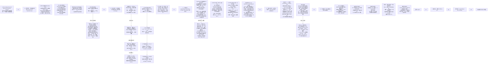

```mermaid
flowchart TD
    n0["A Time Scaling Theory for Multi-Layer Electronic Systems<br/>多层电子系统的时间缩放理论 —「τ 缩放」理论框架图"]
    n1["A0"]
    n2["A · 时代背景：几何缩放的终结 (The End of the Geometric Era)"]
    n3["摩尔几何缩放时代 (1965–2007)<br/>晶体管密度约每 2 年翻番 (Moore 1965)<br/>电压/尺寸等比缩放维持恒定电场 (Dennard 1974)<br/>空间缩放 = 压缩时间的手段"]
    n4["7nm 之后回报趋平<br/>· 2005 年 Dennard 缩放先行失效 (暗硅时代)<br/>· EUV 折旧主导晶圆成本<br/>· 每晶体管成本不再下降、甚至上涨<br/>· 领先芯片设计预算突破 $10 亿/颗"]
    n5["额外约束 (华为/受限组织)<br/>获取最先进光刻工具受限<br/>等待下一个工艺节点不再可行<br/>→ 必须改写优化目标本身"]
    n6["核心问题已改变<br/>不再是「晶体管还能缩小多少？」<br/>而是「该缩放什么、以什么为目标？」"]
    n7["B0"]
    n8["B · 核心思想：τ 时间缩放 — 跨全栈的统一时间常数 (τ Scaling)"]
    n9["「把时间 (τ) 而非面积，作为进步的主要度量」<br/>更小的晶体管之所以提速 − 因为开关更快；更密的互连 − 走线更短；更强的集成 − 边界更少 → 每一代的本质都是「时间的缩短」。<br/>空间缩放只是压缩时间的工具之一，而非唯一途径 · 时间轴: 皮秒 → 秒 · 空间轴: 纳米 → 千米 (约 12 个数量级)"]
    n10["晶体管层 τtr · 皮秒 (ps)<br/>本征开关延迟 + 局部互连寄生R/C<br/>手段：迁移率增强 / 应变工程<br/>高κ金属栅极 / GAA 架构"]
    n11["电路层 τckt · 纳秒 (ns)<br/>信号路径 RC 传播延迟<br/>手段：低电阻导体 / 低k电介质<br/>垂直集成缩短导线 ← 逻辑折叠"]
    n12["芯片层 τchip · 微秒 (µs)<br/>计算 + 内存访问延迟<br/>手段：架构选择 / 流水线深度<br/>内存层次结构 / 片上互连 (NoC)"]
    n13["系统层 τsys · 秒 (s)<br/>端到端消息 / 同步时间<br/>手段：互连拓扑 / 协议栈 / 互连架构<br/>数据搬运主导 AI 集群能耗 (>80%)"]
    n14["① 定义各层特征时间 τ<br/>晶体管(ps) / 电路(ns) / 芯片(µs) / 系统(s)<br/>覆盖约 12 个时间数量级"]
    n15["② 分层分解模型<br/>τ_sys = f(τ_tr, τ_ckt, τ_chip, τ_sys)<br/>每层 τ = 下层 τ + 本层组织/通信开销"]
    n16["③ 代际递归规则：τ(n+1) = τ(n) / α<br/>缩放因子 α 与应用相关：<br/>移动 ≈1.3×/年 · 自动驾驶 ≈1.5×/年 · AI ≈10×/年"]
    n17["④ 跨层协同执行 + 时间-代价权衡<br/>垂直互连非免费：每层须满足<br/>Δ(τ 减少) > Δ(τ 开销)"]
    n18["同一度量 = 同一门语言：频率 / 延迟 / 带宽 / 吞吐量 均由 τ 支配 — 构成「工艺工程师 ↔ 电路设计师 ↔ 系统架构师」共同的全栈优化目标"]
    n19["C0"]
    n20["C · 工程实例：LogicFolding / Unified Bus / Hi-ONE / 3D Folding (三层协同)"]
    n21["LogicFolding 逻辑折叠 · 电路/芯片层<br/>竖直堆叠有源层 + 超级细混合键合 (间距 <2µm, Kirin 2026 = 1.5µm)<br/>关键路径门分布在两层 → 走线大幅缩小<br/><br/>导线长 −30% · 时钟缓冲器 −50% · 时钟偏差 −25%<br/>SRAM 工作频率 +40% · NoC 数据路径面积 −33%<br/>固定工艺节点上的拓扑重组 — 不靠新光刻"]
    n22["Unified Bus 统一总线 · 系统层<br/>单一协议层取代 PCIe/NVLink/Ethernet<br/>/InfiniBand 多层转换栈<br/>内存语义 · 免转换对等传输<br/>硬件管理缓存一致性 替代软件栈消息传递<br/><br/>实测：远程访问延迟<br/>~数 10 µs → ~100 ns (≈ 500×)"]
    n23["Hi-ONE 近封装光互连 · 系统/光层<br/>光引擎 8 Tb/s/模块 · 匹配每芯片 UB 带宽<br/>SerDes 距离 ~100cm → ~5cm<br/>互连距离 <1m → 100m (千兆瓦级数据中心)<br/>线性模拟方案 + 协议容忍误码<br/>= 跨层「时间–功耗」权衡的实践"]
    n24["扇出困境 (Fan-out Dilemma) → 3D Folding 不可避免<br/>2.5D：计算容量按面积 N² 增长 · 带宽/I/O/供电按周边 N 增长 → 差距不断拉大 (拓扑缺陷无法用晶体管级改进弥补)<br/>3D：把供电(背面供电) / 内存(混合键合) / 光 I/O(Hi-ONE) 从边缘迁到表面 → 恢复为 N² 等比缩放"]
    n25["D0"]
    n26["D · 验证与结论：381 款芯片量产 · Kirin 2026 实测 · 方法论意义"]
    n27["验证点① — 移动 SoC (Kirin 2026 · 量产实测)<br/>· 晶体管密度: 155 → 238 MTr/mm² (+55%，单步)<br/> (过去需约 3 年几何缩放才能达成)<br/>· SoC 性能核能效 +41% · CPU 频率 +13% (3.1 GHz)<br/>· 硅后时钟偏差调整独立贡献 >5% 性能<br/>· 代表性核心: 时钟缓冲 −50% · 导线 −30%"]
    n28["验证点② — AI 系统 (Unified Bus + Hi-ONE + 3D)<br/>· 远程访问延迟 ~数10µs → ~100 ns≈500× 降低<br/>· Hi-ONE 8 Tb/s 光互连 · 面板距离 <1m → 100m<br/>· System-as-One-Chip：多机架集群如一台统一机器<br/>· 2020.05–2026.05 共 381 款芯片量产 (移动 AI 车/工业)<br/>→ 多机架规模的系统级验证"]
    n29["方法论结论<br/>· 自 Dennard 缩放以来第一个全栈统一目标的缩放原则<br/>· 打破「必须缩小晶体管才能进步」的范式<br/>· 「下一美元跟随 τ，而非节点」→ 封装 / 内存带宽 / 互连设计获得前所未有的战略权重"]
    n30["未来 6–10 年路线图 …<br/>· 2035 硬件集成度 >100× · 密度 400+ MTr/mm² (2031)<br/>· CPU 频率 → 4 GHz+ (2029) · Kirin 能效 3–5 年内翻番<br/>· AI: 2030 引入 AI 侧折叠 (Ascend) → 主线<br/>· 封装 3–4 层 active die · TSV 落点下移至 M6"]
    n31["E0"]
    n32["E · 开放挑战：时间–能量权衡与工程落地"]
    n33["EDA 工具链缺失<br/>现行 EDA 面向面积/时序 3 轴独立优化<br/>需把多层堆叠 die 当…单一连续设计实体：<br/>单元级逻辑划分 · 三维协同布局 · 时序收敛"]
    n34["晶圆间工艺变异<br/>Vth / 驱动电流 / RC 层间变异大于层内<br/>→ 需要智能冗余 / 自适应补偿<br/>与 τ 感知的 signoff 流程"]
    n35["垂直互连开销<br/>混合键合 / TSV 皆有 R、C 与 KOZ 代价<br/>→ 每层须满足：<br/> Δ(τ 减少) > Δ(τ 开销)<br/> 不划算的场景就放弃"]
    n36["能量：τ 是时间定律，不是焦耳定律<br/>快 10× 功耗 10× 会压垮电网<br/>→ 需要一个能量伴侣：光互连改功耗<br/>· 背面供电 · 计算近内存/存内计算<br/>· 数据中心级 DVFS"]
    n37["基准测试过时<br/>Linpack / MLPerf / SPEC 的标量值已不适用<br/>→ 需要剖面基准：向量暴露每层主导 τ，为下一笔投资指明方向"]
    n38["图例 Legend"]
    n39["lg1"]
    n40["τ 理论核心（命题 / 分层 / 公式）"]
    n41["lg2"]
    n42["技术实现（LogicFolding / UB / Hi-ONE）"]
    n43["lg3"]
    n44["验证数据 / 结论 / 路线图"]
    n6 -->|"答案：时间本身"| n9
    n10 -->|"下层时间 +"| n11
    n11 -->|"+组织/通信开销"| n12
    n12 -->|"层层累加 →"| n13
    n14 --> n15
    n15 --> n16
    n16 --> n17
    n21 -->|"量产实测 → 数据"| n27
    n29 -->|"实证 → 提炼"| n30
```
